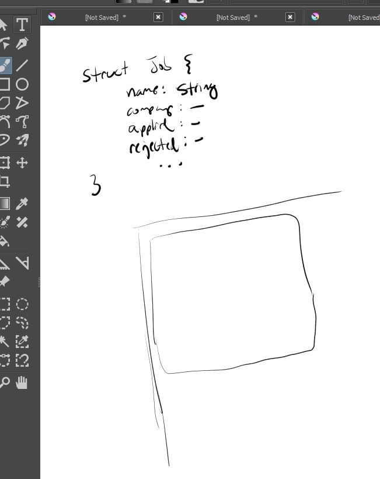

10/21/2023

ugh... lost my git history

I'm doing this on an Asus C100P Chromebook running Xenial XFCE on an SD Card on VS Code

I was able to get hello world running. VS Code file discovery is slow

I keep accidentally clicking somewhere I think because my thumb keeps grazing the touchpad

8:21 PM

geez what a waste of time using git ssh over git

I don't have a battery meter looks like

8:26 PM

alright added a battery icon to my panel

8:48 PM

I was thinking I could do the CLI thing which has API interfaces to my local RPis that hit the web eg. google spreadsheet

that would be a useful/familiar ground thing to learn Rust with

20:59 PM

I'm watching tv I will write something though, probably as I cook now, 55% charge

21:18 PM

having import issues with a crate, trying to use chrono

9:38 PM

lol I can't get past this chrono unresolved...

---

10/18/2023

10:48 PM

Please Jacob do it

hell yeah babyyyyyy hello world

I'm trying to make an "API" for like a note app, but it's just in memory

just to flex my code skills

it's like a text rpg game

11:20 PM

omg... my ADHD brain man, turn off social media

get prompt, that's what I want, then spit it back out

11:47 PM

omg I got sidetracked again damn

okay `&` is a reference there's also `*` to dereference hmm

---

10/17/2023

10:51 PM

I'm pretty spent today and spent the remainder of my mental energy watching tv... so...

I did come up with something more tangible, back to the classics, a CLI CRUD app

that'll get me to start writing rust

---

10/16/2023

11:13 PM

tired af

gonna at least start the app, doesn't really count for progress

cargo mobile takes a while to install

I'm thinking about reprogramming my insect quad robot in rust, that would be a challenge

Also to actually do inverse kinematics to move the legs vs. manually-programmed gaits

11:20 PM

gotta update rust meesa got 1.64

11:24 PM

hmm don't know why I need a name unless it's that com stuff in android

also this `bevy` or `wry` what is...

bevy is game engine

whoa this egui thing is neat

wgpu graphics api

winit, window creation and management library

so I guess I have to use wry for android

11:31 PM

what is this NDK_HOME

11:37 PM

had to go into android studio

https://developer.android.com/studio/projects/install-ndk

install it from sdk manager along with cmake, maybe not necessary

11:46 PM

damn another problem

11:52 PM

hmm I got it to work but turning that developer mode toggle is sus, haven't done that ever on windows

11:55 PM

so far `cargo androind open` didn't work... `cargo run` is doing something

hmm... I might just stick with tauri desktop for now and React Native

11:59 PM

wait a minute... (Independence Day chess scene)

12:01 PM

I so sorry, I will revisit another time

---

10/12/2023

12:38 AM

I'm going to make a job hunting app, has defined requirements/made some before.

Will use Rust heavily hopefully and make a desktop app to refresh skills again.

12:46 AM

ehh... I don't see a design yet in my mind

I have to sqlite too, last time I tried I failed

